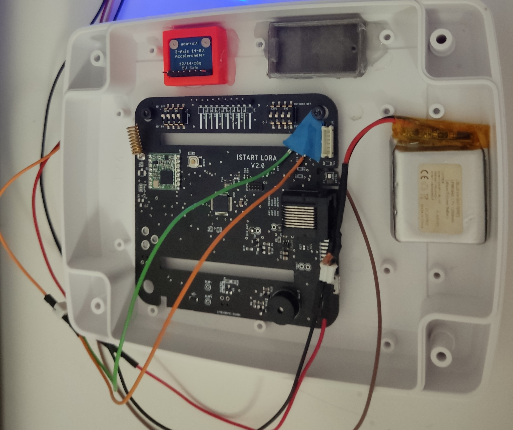
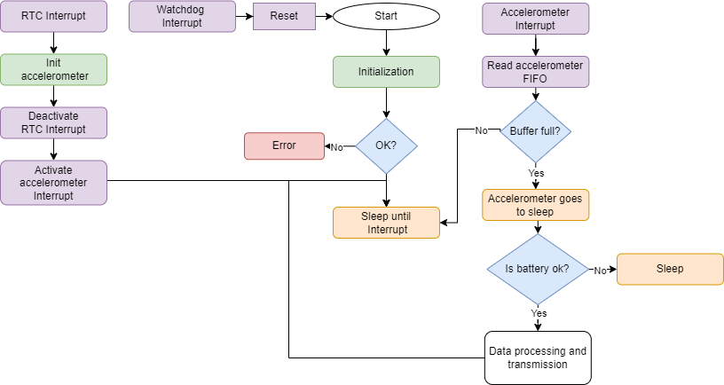

# Air Conditioner Monitoring Edge Device

The air conditioner edge device main board was made by iStartLab and the main components used were an ATSAMD21G18A microcontroller and a RFM95W-868S2 LoRa communication module. Additionally, an external MMA8451Q accelerometer was connected in the i2c bus to measure the air conditioner vibration.

## Edge Device

  
  

