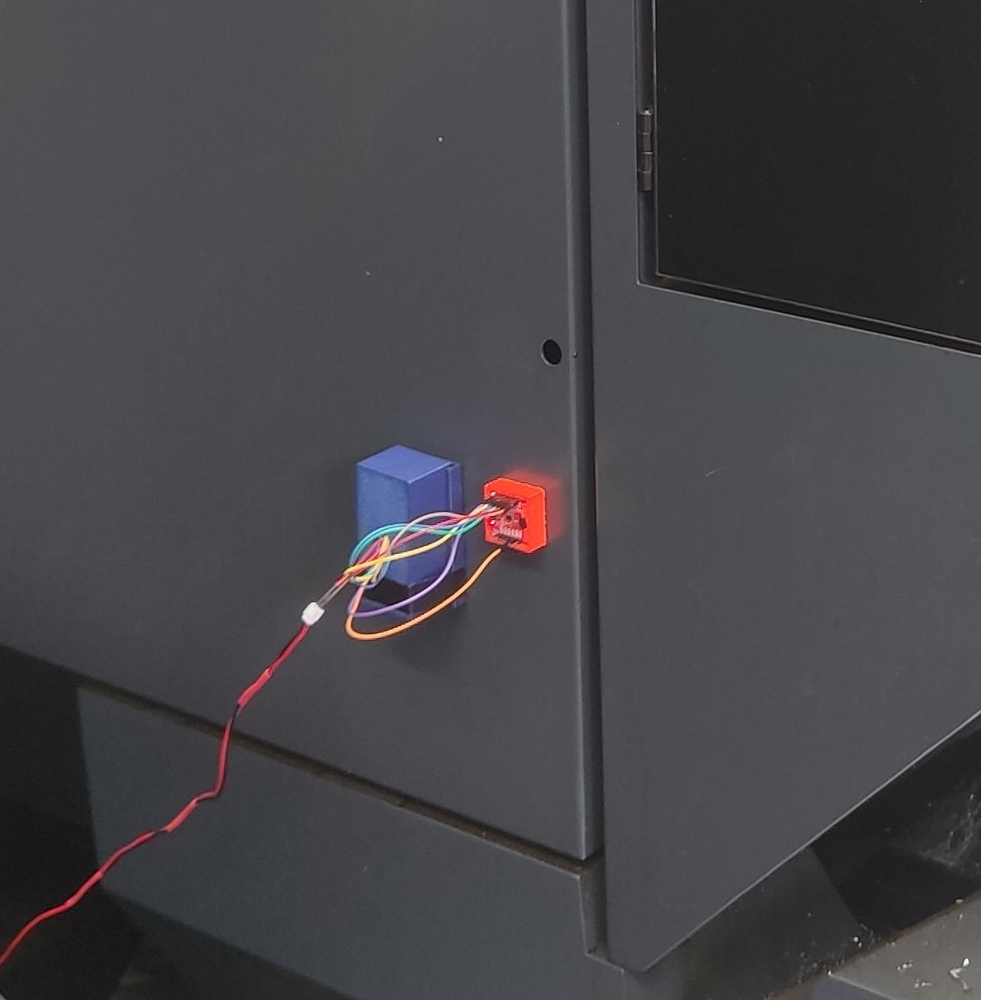
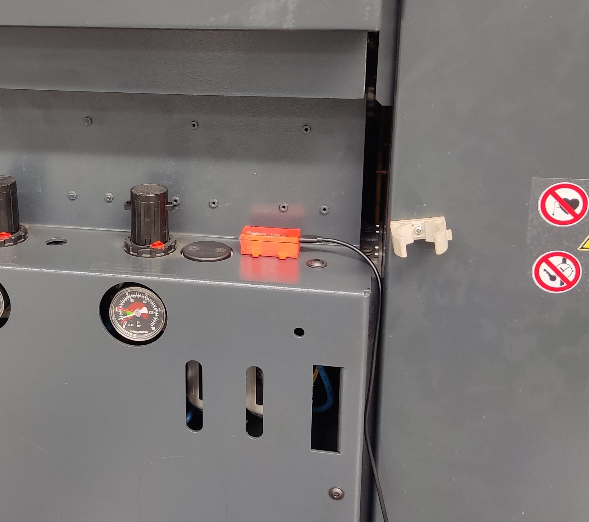
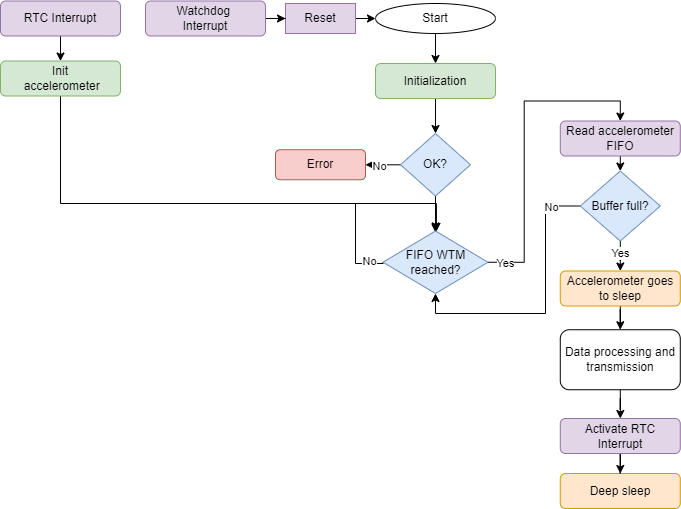

# CNC SOCEM Monitoring Devices

Several devices were developed to monitor a CNC machine in [SOCEM](https://socem.pt/) company:

- **ESP32-S3_EdgeDevice**: To monitor the vibration of the CNC, an edge device has been improved along the use cases and in the current one it has the ESP32-S3 DevKitC-1 board. This device collects data from an external accelerometer and processes it to extract features. The features are then sent by BLE to the gateway. This edge device also has low-power capabilities, being able to enter sleep mode and wake up periodically to collect, process and transmit data so that it can be deployed with a battery.

- **GatewayBLE**: To transmit the data with BLE, a gateway was developed from an ESP32-S3 to receive the BLE data from the accelerometer edge device and send it by Wi-Fi to the ThingsBoard IoT platform. The gateway is always searching for the accelerometer edge device and when it finds it, it connects to it, receives the data and sends it to the ThingsBoard IoT platform.

- **ArduinoConnectEdgeDevice**: To monitor the audio of the CNC, an edge device was developed with an Arduino Nano RP2040 Connect board. This device collects data from the built-in microphone and processes it to extract features. The features are then sent by Wi-Fi to the ThingsBoard IoT platform. This device is connected to the grid and does not have low-power capabilities.

  
  

The left image shows the accelerometer edge device and the right image shows the microphone edge device.

## ESP32-S3_EdgeDevice Flowchart

