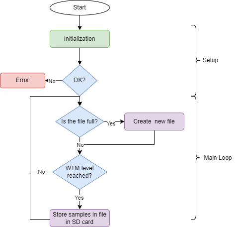

# CNC iStartLab Monitoring Devices

Two devices were developed to monitor the raw vibration of a CNC machine from iStartLab. These devices were developed with two different boards, the SparkFun OpenLog Artemis and the Teensy 4.1. The collected data from both devices was stored in a microSD card and then processed in Python to extract features and train machine learning models.

The main reason for the development of two devices is that the LSM6DSO accelerometer was not available at the beginning of this monitoring use case. So the Openlog Artemis was used while the LSM6DSO was not available.

  
  

The image above shows the two devices developed. The OpenLog Artemis is on the left and the Teensy 4.1 is on the right.

## Teensy 4.1 Flowchart

